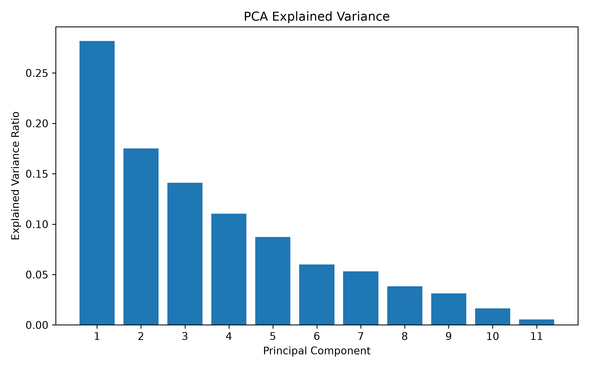
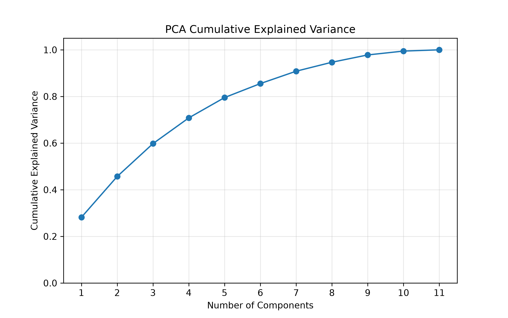
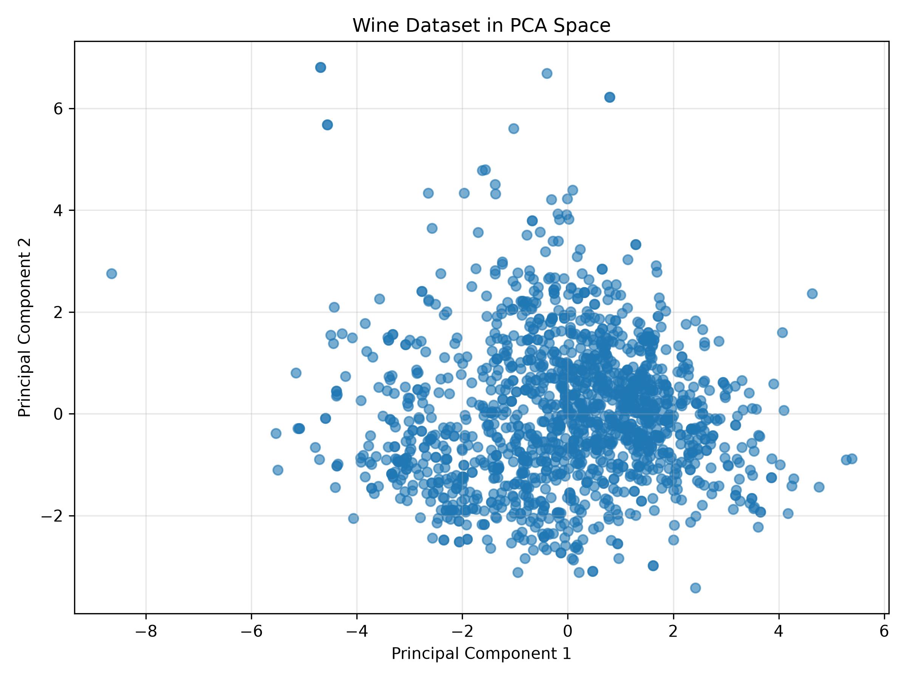
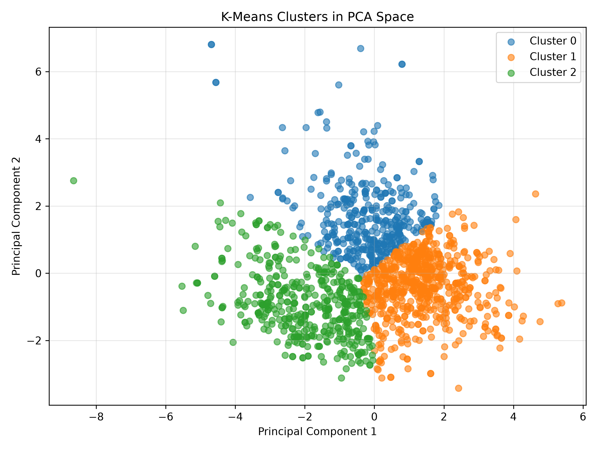
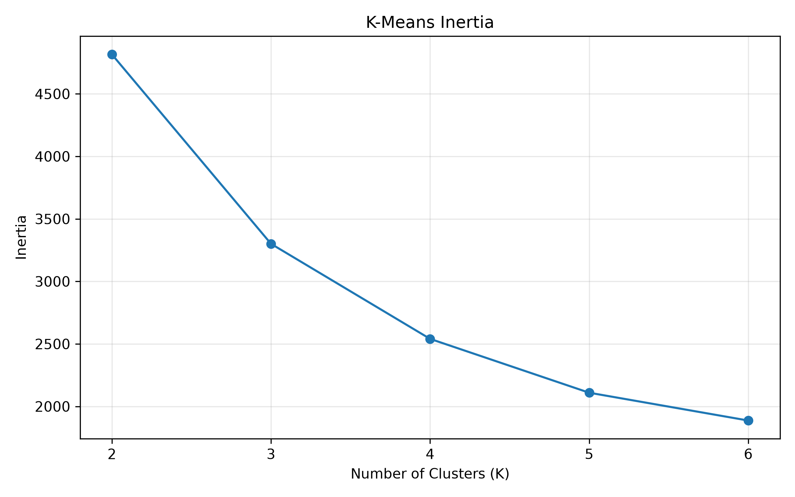
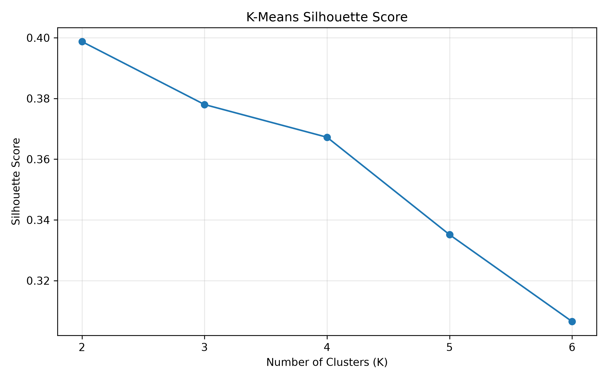

# Spectral Learning Project

A from-scratch implementation of **PCA, SVD, and K-Means clustering** using the Wine Quality dataset. The project explores dimensionality reduction, variance preservation, and unsupervised learning using spectral methods.

## 1. Project Overview

This project implements the core algorithms using **NumPy**, without relying on ready-made PCA or SVD implementations.

The pipeline:

* Loads and preprocesses the Wine Quality dataset
* Standardizes the feature matrix
* Performs PCA using covariance matrix eigenvalue decomposition
* Performs SVD using eigenvalue decomposition of \(X^TX\)
* Projects the data into two dimensions
* Applies K-Means clustering
* Evaluates clustering using inertia and silhouette score

## 2. Dataset

The project uses the **Wine Quality Red** dataset.

* Samples: **1,599**
* Features: **11**
* Target: `quality`
* Input features are standardized before spectral analysis

## 3. PCA Results

The first two principal components explain **45.68%** of the total variance.

| Component | Variance |
| --------- | -------: |
| PC1       |   28.17% |
| PC2       |   17.51% |
| PC3       |   14.10% |
| PC4       |   11.03% |
| PC5       |    8.72% |





The first **7 components explain approximately 90.83%** of the variance.

## 4. SVD

SVD was implemented through the relationship:

$$
X^TXv_i = \sigma_i^2v_i
$$

The singular values were used to calculate the explained variance.

The PCA and SVD explained-variance ratios matched with a maximum difference of:

```text
0.0000000000
```

This demonstrates the mathematical relationship between PCA and SVD for the standardized data matrix.

## 5. Dimensionality Reduction

The dataset was projected from **11 dimensions to 2 dimensions** for visualization.



The two-dimensional representation preserves **45.68%** of the original variance.

## 6. K-Means Clustering

K-Means was implemented from scratch and applied to the 2D PCA representation.

For `K = 3`:

* Cluster 1: 416 samples
* Cluster 2: 722 samples
* Cluster 3: 461 samples
* Inertia: **3300.59**
* Silhouette score: **0.3780**



## 7. Cluster Evaluation

Different values of K were evaluated using inertia and silhouette score.

|  K | Inertia | Silhouette |
| -: | ------: | ---------: |
|  2 | 4815.36 |     0.3987 |
|  3 | 3300.59 |     0.3780 |
|  4 | 2540.29 |     0.3672 |
|  5 | 2109.66 |     0.3351 |
|  6 | 1887.11 |     0.3065 |





## 8. Project Structure

```text
spectral-learning-project/
├── data/
│   └── winequality-red.csv
├── models/
│   ├── pca_model.py
│   ├── svd_model.py
│   └── __init__.py
├── utils/
│   ├── data_loader.py
│   ├── matrix_operations.py
│   ├── clustering.py
│   ├── visualization.py
│   └── __init__.py
├── results/
│   ├── pca_explained_variance.png
│   ├── pca_cumulative_variance.png
│   ├── pca_projection.png
│   ├── kmeans_clusters.png
│   ├── kmeans_inertia.png
│   └── kmeans_silhouette.png
├── main.py
├── requirements.txt
└── README.md
```

## 9. Running the Project

```bash
pip install -r requirements.txt
python main.py
```

The complete pipeline prints the PCA, SVD, and clustering results and generates the visualizations in `results/`.

## 10. Key Concepts

This project demonstrates practical understanding of:

* Eigenvalue decomposition
* Singular Value Decomposition
* Principal Component Analysis
* Dimensionality reduction
* Variance preservation
* Matrix operations with NumPy
* K-Means clustering
* Silhouette analysis
* Spectral methods in machine learning
